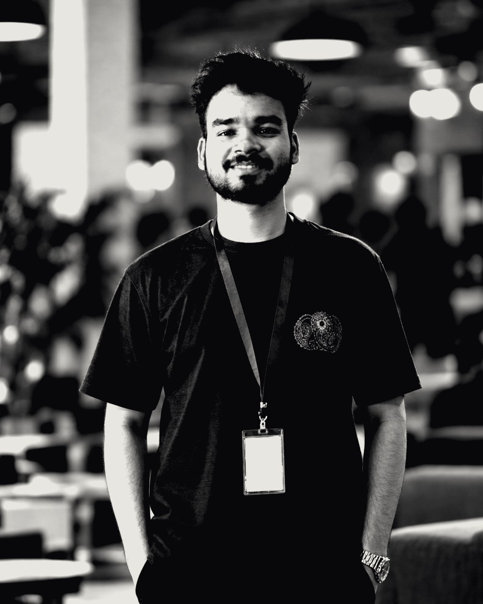

# Portfolio — Kinetic Scroll Story

Static site. No build step, no dependencies, no `npm install`.
Open `index.html` and it works.

```
portfolio/
├── index.html               all content lives here
├── css/styles.css           chapter themes + layout
├── js/main.js               the scroll engine
├── assets/
│   ├── favicon.svg
│   ├── portrait.svg         <- PLACEHOLDER, replace with your photo
│   ├── project-01..03.jpg   project screenshots
│   ├── resume.pdf           the real CV
│   ├── resume-preview.png   page 1, rendered  (regenerate — see below)
│   └── og-image.png         <- 1200x630 social preview, still missing
├── tools/
│   └── make-resume-preview.py   dev script, not deployed
└── README.md
```

## The idea

The page is seven **chapters**. Each `<section>` declares
`data-chapter="light | dark | accent"`, and whichever chapter owns the middle
of the viewport repaints the entire page palette.

It is a **Batman theme**: the page never goes bright. The names `light` /
`dark` / `accent` are kept for the markup, but all three are now shades of
night — raised charcoal, deepest black, and a warm black with the
bat-signal burning behind the finale. The rhythm comes from depth rather
than inversion, so the chapter changes are quieter than a light-to-dark
flip would be. That is the trade for an all-dark page.

| # | Chapter | Theme | Motion |
|---|---|---|---|
| 1 | Hero | charcoal | Name in white, large portrait right; every letter warps toward the cursor |
| 2 | Approach | black | Words light up one at a time as the block crosses the viewport |
| 3 | Work | black | **Pinned** — the section sticks and projects scroll sideways |
| 4 | Skills | charcoal | Rows wipe with bat-signal yellow on hover |
| 5 | Experience | black | The rail draws itself down as you read |
| 6 | Résumé | charcoal | The PDF's first page as a tilted sheet; straightens on hover |
| 7 | Contact | warm black | Bat-signal glow behind the headline, giant marquee |

## Make it yours

Everything is in `index.html`, top to bottom.

| What | Where |
|---|---|
| Name, title, meta | `<head>` — the `EDIT: page metadata` block |
| Your name (the huge one) | `.hero__name` |
| Italic aside under the name | `.hero__since` |
| Availability / location line | `.hero__lang` |
| Your photo | `.hero__portrait` — see below |
| The one-line statement | `.manifesto__text` |
| Projects | `.reel__track` — JanVaani, Smart Attendance, CryptoCurrency, GitHub |
| Skills | `.caps__list` — four `<li class="cap">` |
| Experience + education | `.exp__list` |
| Résumé blurb + stats | `.resume__side` |
| Email + socials | `.contact` section |

### Still to fill in

Content is complete. Two optional extras:

| What | Where |
|---|---|
| `assets/og-image.png` | 1200x630 social preview — `<meta property="og:image">` already points at it, but the file does not exist yet, so link previews will be blank |
| Your real photo | `assets/portrait.svg` is still my hand-drawn placeholder — see below |

### The résumé section

`assets/resume.pdf` is the real file. Chapter 6 shows
`assets/resume-preview.png` — page 1 rendered to an image — and clicking it
opens the PDF.

It is an image rather than an `<iframe>` on purpose: PDF embeds render
blank or force a download on most mobile browsers, and an image is styled
by the page like everything else.

**When you replace the resume, the preview does not update itself.** Drop
the new PDF at `assets/resume.pdf`, then:

```bash
pip install pymupdf pillow
python tools/make-resume-preview.py
```

That regenerates the preview and prints its dimensions — if they changed,
update `width`/`height` on the `` in `index.html` so the page does not
shift while it loads. `tools/` is a dev script; it is not part of the
deployed site.

### Project previews

`assets/project-01…03.jpg` are real screenshots, 1200x900, ~125 KB total.
They were captured with headless Chrome:

```bash
chrome --headless=new --window-size=1280,960        --screenshot=shot.png https://your-demo-url
```

If a project is not deployed, clone it and render the source instead — the
result is the same as long as it has no backend:

```bash
git clone --depth 1 https://github.com/HowSuyash/<repo>
chrome --headless=new --window-size=1280,960        --screenshot=shot.png file:///abs/path/<repo>/index.html
```

On Windows PowerShell, do **not** redirect Chrome's stderr with `2>$null`
— it makes the screenshot look like it failed when the file was written
fine. Pipe to `Out-Null` instead.

Then cropped to 4:3 and saved as JPEG (the panel frame is
`aspect-ratio: 4/3` with `object-fit: cover; object-position: top center`,
so the top of the page always survives the crop).

To swap one out, replace the file and keep the name. The gradient behind
it stays as the loading colour. `.panel__visual--shot` switches off the
decorative grid overlay so it does not sit on top of the screenshot.

Your phone number is live on the page in `.contact__socials`. Delete that
line if you would rather not have it scraped.

Contact email is `suyashshukla0702@gmail.com`, in 2 places (the `mailto:`
link and the `data-copy` button).

### Adding or removing projects

Add another `<article class="panel">` inside `.reel__track`. The pinned
section measures the track and sets its own scroll height on load and on
resize, so the horizontal distance is always exact — nothing to configure.

One thing is **not** automatic: the `/ 04` total in `.reel__counter`.
Update that by hand.

### Change the accent

`css/styles.css`, first block. One value:

```css
--accent-raw: #ffd84d;   /* bat-signal yellow (default) */
```

| Colour | Value |
|---|---|
| Amber | `#ffb020` |
| Ice blue | `#7dd3fc` |
| Acid green | `#ccff00` |

The three greys are next to it:

```css
--bone:  #f4f4f6;   /* text */
--coal:  #08080a;   /* deepest night */
--slate: #15151b;   /* raised charcoal */
```

Every chapter is dark now, so the accent only ever sits **on** near-black —
pick something bright. The name itself is hard-set to `#fff` in
`.hero__name`, brighter than body text on purpose.

One thing tuned for the dark page: the resting weight of the hero letters
is `wght 460` rather than 380. Thin white strokes on near-black read
optically grey, so the rest state is lifted until the name is
unmistakably white. See `REST` in `js/main.js` section 4c.

### Change the type

Two variables in `:root`, plus the Google Fonts `<link>` in `<head>`:

```css
--font-display: 'Bricolage Grotesque', ...;   /* headlines */
--font-body:    'Inter', ...;                 /* paragraphs */
--font-mono:    'JetBrains Mono', ...;        /* labels */
```

Display faces that suit this layout: `Anton`, `Syne`, `Archivo Expanded`,
`Space Grotesk`, `Instrument Serif` for something softer.

### Tuning the cursor effect on the name

Every letter of `.hero__name` is wrapped in its own `<span data-vft-letter>`
by JS. On pointer move, each one interpolates the **`wght`** and **`wdth`**
axes of Roboto Flex by how close the cursor is — so the name fattens and
widens under your pointer and settles back as you leave.

Four numbers control it, at the top of section 4c in `js/main.js`:

```js
var REST   = { wght: 460, wdth: 93 };    // at rest — light and slightly condensed
var HOT    = { wght: 900, wdth: 145 };   // directly under the cursor
var RADIUS = 190;                        // px of reach
```

Bigger `RADIUS` = a broader, softer wave. A bigger gap between `REST` and
`HOT` = more violent. Set `REST.wght` high and `HOT.wght` low to invert it,
so letters *thin out* as you approach.

This only works with a font that carries both axes. If you swap
`--font-flex`, pick another variable font with `wght` **and** `wdth`
(Roboto Flex, Recursive) and update the Google Fonts `<link>` — with a
static font the letters simply sit at their rest weight and nothing moves.

The effect is skipped entirely on touch devices and under
`prefers-reduced-motion`.

### The hero portrait  ← replace this

`assets/portrait.svg` is a **placeholder** I drew by hand — a Batman cowl
silhouette, not you. Swap it for a real image.

**1. Generate it.** To keep your own face, upload a clear photo of yourself
to an image tool that edits from a reference — ChatGPT, Google Gemini,
Midjourney (`--cref <photo url>`), or Photoshop generative fill. Prompt:

> Cinematic portrait of the person in this photo wearing a matte black
> Batman cowl and armoured suit. Head and shoulders, three-quarter angle,
> looking just off camera, jaw and mouth visible below the cowl. Hard rim
> light from the left in electric lime-yellow (#ccff00), deep near-black
> background (#09090a). High contrast, sharp cowl texture, subtle film
> grain, shallow depth of field. Vertical 4:5 crop. Keep the face
> recognisable.

Text-to-image alone will not look like you — it needs your photo as input.

**2. Crop it 4:5 vertical** (e.g. 800 × 1000). The frame is `aspect-ratio: 4/5`
with `object-fit: cover`, so any other ratio gets cropped, not squashed.
Keep your face in the upper-middle third.

**3. Drop it in** as `assets/portrait.jpg` (or `.webp` — smaller), then update
one line in `index.html`:

```html

```

Update the `alt` text to describe the real image, and change the
`<figcaption>` from `◆ after hours` to whatever you want on hover.

**Size and position** — the hero is a two-column grid: name on the left,
portrait filling the right column. Its width is the column width, set in
`.hero__inner`:

```css
grid-template-columns: minmax(0, 1fr) clamp(230px, 34vw, 520px);
                                      ^^^^^^^^^^^^^^^^^^^^^^^^^
```

Raise `34vw` / `520px` to make it bigger, lower them to make it smaller.
The frame holds `aspect-ratio: 4/5` with a `max-height: 76svh` guard so it
cannot run off a short screen — when that guard bites, `object-fit: cover`
crops instead of letterboxing.

Below 900px the grid collapses to one column and the portrait drops under
the name at `min(70%, 340px)`; below 700px, `min(82%, 300px)`.

The image is 65% desaturated at rest and goes full colour on hover, with a
lime ring and the caption sliding up. To make it colour all the time, delete
the `filter` line in `.hero__portrait img`.

It also tilts toward the cursor — `js/main.js` section 4b. `pcx * 22` /
`pcy * 16` are the drift in pixels; `pcx * 11` / `pcy * 8` are the tilt in
degrees. Angles are kept low deliberately: the same rotation that reads as
subtle on a small chip looks violent on a panel this size. The 3D comes
from `perspective: 1200px` on `.hero__inner`. Delete the block to pin it
still.

### Real project screenshots

Panel visuals are CSS gradients, so nothing is broken by missing images.
To use a real one, replace:

```html
<div class="panel__visual panel__visual--01" aria-hidden="true"><span>◈</span></div>
```

with:

```html

```

and add to `styles.css`:

```css
img.panel__visual { object-fit: cover; }
```

## Run it locally

Double-click `index.html`, or serve it (clipboard copy needs a real origin
in some browsers):

```bash
python -m http.server 5173
# or
npx serve .
```

## Deploy — free

**Netlify Drop** — drag the folder onto https://app.netlify.com/drop. Live in ~10 seconds.

**Vercel**
```bash
npx vercel --prod
```

**GitHub Pages**
```bash
git init && git add -A && git commit -m "portfolio"
git branch -M main
git remote add origin https://github.com/YOURNAME/YOURNAME.github.io.git
git push -u origin main
```
Then Settings → Pages → Source: `main` / root.

## How the motion works

All scroll-linked animation runs in **one** `requestAnimationFrame` loop
(`js/main.js`, section 13). Each effect registers a task; the loop calls
them in order. Layout measurements are cached and only recomputed on a
debounced resize, so nothing thrashes the layout mid-scroll.

Everything is transform and opacity only — no animating width, height,
top or left — so it stays on the compositor.

## Fallbacks

- **No JavaScript** — `<html>` never gets the `.js` class. Split text stays
  visible, the pinned reel becomes an ordinary horizontal scroller with
  scroll-snap, nothing is hidden.
- **`prefers-reduced-motion`** — every scroll-linked task is skipped, the
  reel un-pins, the cursor is removed, transitions collapse to nothing.
- **Touch / coarse pointer** — custom cursor and magnetic hover never
  initialise.
- **`file://`** — clipboard falls back to `execCommand`.

## Accessibility notes

- Semantic sections, real heading order, skip link, visible focus rings
- Decorative visuals are `aria-hidden`; the ticker text is decorative
- Colour is never the only signal
- Print stylesheet un-pins the reel so the page prints as a flat document

The one honest tradeoff: a pinned horizontal section means the work chapter
takes several screens of scrolling to pass. That's the format. If you'd
rather have a plain vertical project list, delete the `data-reel` attribute
from `<section class="reel">` and the JS leaves it alone.
