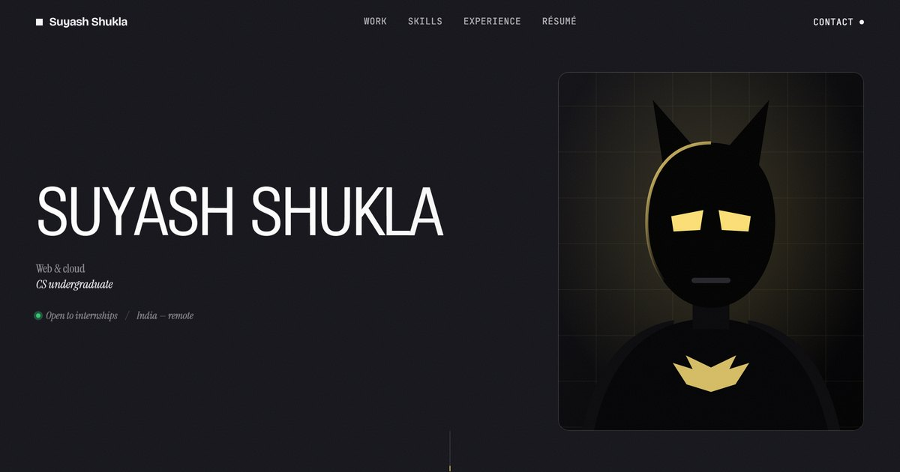

# Suyash Shukla — Portfolio

Personal site. Vanilla HTML, CSS and JavaScript — no framework, no build
step, no dependencies.

**Live:** [howsuyash.github.io](https://howsuyash.github.io)



## What's in it

Seven full-height chapters. Each one declares its own palette and the page
repaints as it scrolls past, so the whole thing moves through shades of
near-black with a single accent carrying it.

- **Hero** — the name is set in Roboto Flex, and every letter interpolates
  its `wght` and `wdth` axes by how close the cursor is, so the type swells
  under the pointer and settles as it leaves.
- **Work** — a pinned section that scrolls sideways through three projects,
  each with a real screenshot of the deployed site.
- **Résumé** — page one of the PDF, rendered to an image and laid on the
  page like a sheet of paper.
- **Contact** — email, links, and a marquee.

## Running it

Any static server:

```bash
python -m http.server 5173
```

Then open <http://127.0.0.1:5173>. Opening `index.html` directly works too,
though the résumé PDF and project images behave better over HTTP.

## Notes

Animations are written so they can only ever fail *visible* — content is
never hidden by a base style waiting on a script. Scroll reveals arm only
what starts below the fold, and the reveal runs from both the frame loop
and a scroll listener so one stalling cannot leave a section blank.

Motion is skipped entirely under `prefers-reduced-motion`, and the
cursor-driven effects are gated behind a fine pointer, so touch devices get
the static layout.

Deeper notes — palette, tuning the cursor effect, regenerating the résumé
preview — are in [DEVELOPING.md](DEVELOPING.md).
